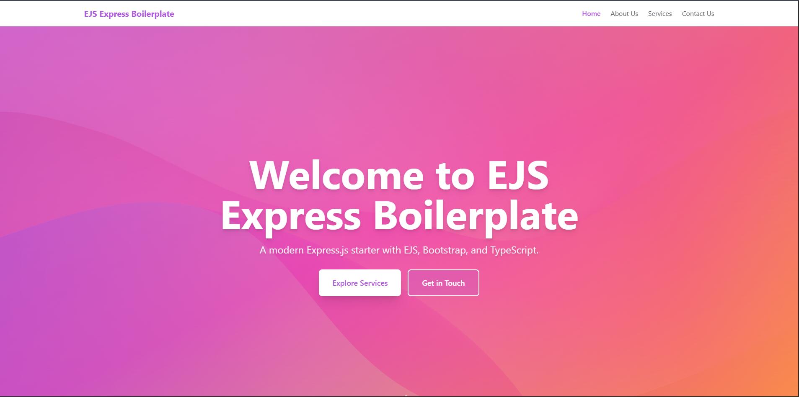

# Ejs Express Boilerplate
Ejs Express Boilerplate is a modern Express.js starter template using EJS, Tailwind CSS, and TypeScript. It features Next.js-style nested layouts, dynamic file-based routing, and a clean project structure for rapid web development.

## Features

- Express.js with TypeScript
- EJS templating with Next.js-style nested layouts
- Dynamic file-based routing with `[param]` syntax
- Metadata and SEO support
- Static asset management via public directory
- Hot-reloading with LiveReload
- Security middleware (Helmet, Rate Limiting, HPP)
- Tailwind CSS with custom color theming

## Getting Started

### Prerequisites

- Node.js v18 or higher
- npm (comes with Node.js)

### Installation

1. Clone the repository:
   ```bash
   git clone <repo-url>
   cd express-ejs-boilerplate
   ```

2. Install dependencies:
   ```bash
   npm install
   ```

### Development

Start the development server with hot-reloading:

```bash
npm run dev
```

The app will compile TypeScript files and start the server. By default, it runs on [http://localhost:8080](http://localhost:8080).

### Build for Production

```bash
npm run build
npm start
```

## Project Structure

```
├── src/
│   ├── app.ts                # Express app setup
│   ├── server.ts             # Server entry point
│   ├── lib/                  # Routing and utilities
│   │   ├── routes.ts         # Route manager and layout detection
│   │   ├── dynamic-router.ts # Dynamic routing middleware
│   │   ├── security.ts       # Security middleware
│   │   └── livereload.ts     # Hot-reloading setup
│   ├── types/                # TypeScript types
│   └── site/
│       ├── app/              # Page routes (file-based routing)
│       │   ├── layout.ejs    # Root layout (wraps all pages)
│       │   ├── page.ejs      # Home page
│       │   ├── handler.ts    # Home page data handler
│       │   ├── about-us/     # About page
│       │   ├── contact-us/   # Contact page
│       │   ├── services/     # Services pages
│       │   │   ├── layout.ejs   # Services layout (wraps services routes)
│       │   │   ├── page.ejs     # Services listing
│       │   │   └── [slug]/      # Dynamic service detail pages
│       │   └── ...
│       ├── components/       # EJS partials (header, footer, etc.)
│       └── public/           # Static assets (images, CSS, JS, favicon, etc.)
├── package.json
├── tsconfig.json
├── Dockerfile
└── fly.toml
```

### Key Directories

- **src/site/app/**: All route pages. Each folder represents a route. Dynamic routes use `[param]` syntax (e.g., `[slug]/`).
- **src/site/app/layout.ejs**: Root layout that wraps all pages (includes HTML structure, Tailwind config, header, and footer).
- **src/site/app/*/layout.ejs**: Nested layouts that add additional wrappers for specific route sections (e.g., services layout).
- **src/site/components/**: Reusable EJS partials (header, footer, etc.).
- **src/site/public/**: Static assets directory. All files here are served at the root URL.
  - Images: `/image.png`, `/logo.svg`
  - Stylesheets: `/styles.css`, `/custom.css`
  - JavaScript: `/script.js`, `/app.js`
  - Favicon: `/favicon.ico`
  - Fonts: `/fonts/font-name.woff2`
  - Any other static files

## Data Fetching, Injection, and Metadata

- Each route can have an optional `handler.ts` file alongside its `page.ejs`.
- Data fetching, injection, and metadata manipulation for a route happen in its `handler.ts`.
- The handler returns data and metadata, which are injected into the EJS template.

Example:

```
src/site/app/services/handler.ts
src/site/app/services/page.ejs
```

## Layout System (Next.js-Style Nested Layouts)

This boilerplate uses a Next.js-inspired nested layout system where layouts cascade from parent to child routes.

### How It Works

1. **Root Layout (`src/site/app/layout.ejs`)**: 
   - Wraps ALL pages in your application
   - Contains the HTML structure, `<head>`, Tailwind config, header, and footer
   - Always rendered as the outermost wrapper

2. **Nested Layouts (`src/site/app/*/layout.ejs`)**:
   - Optional layouts for specific route segments
   - Wrapped by the root layout
   - Only affect routes within their directory and subdirectories

### Example Layout Hierarchy

```
app/layout.ejs                    # Wraps everything
  ├─ app/page.ejs                 # Home page (only root layout)
  ├─ app/about-us/page.ejs        # About page (only root layout)
  └─ app/services/layout.ejs      # Services layout
      ├─ app/services/page.ejs    # Services listing (root + services layout)
      └─ app/services/[slug]/page.ejs  # Service detail (root + services layout)
```

### Creating a Nested Layout

To add a layout for a specific section (e.g., `/dashboard`):

1. Create `src/site/app/dashboard/layout.ejs`:
   ```html
   <div class="dashboard-wrapper">
     <aside><!-- Sidebar --></aside>
     <main>
       <%- body %>
     </main>
   </div>
   ```

2. The layout will automatically wrap all pages under `/dashboard/*`

### Key Points

- Layouts cascade: Root layout → Section layout → Page content
- Each layout must include `<%- body %>` to render child content
- The root layout (`app/layout.ejs`) is required and always used
- Nested layouts are optional and route-specific

## Adding Static Assets

All static assets go in **`src/site/public/`** and are served at the root URL path.

### Directory Structure

```
src/site/public/
├── image.png              # Accessible at /image.png
├── logo.svg               # Accessible at /logo.svg
├── favicon.ico            # Accessible at /favicon.ico
├── styles/
│   └── custom.css         # Accessible at /styles/custom.css
├── js/
│   └── script.js          # Accessible at /js/script.js
└── fonts/
    └── custom-font.woff2  # Accessible at /fonts/custom-font.woff2
```

### Usage in EJS Templates

```html
<!-- Images -->


<!-- CSS -->
<link rel="stylesheet" href="/styles/custom.css">

<!-- JavaScript -->
<script src="/js/script.js"></script>

<!-- Fonts in CSS -->
@font-face {
  font-family: 'CustomFont';
  src: url('/fonts/custom-font.woff2') format('woff2');
}

<!-- Favicon -->
<link rel="icon" href="/favicon.ico">
```

### Best Practices

- Organize assets by type in subdirectories (images/, js/, css/, fonts/)
- Use descriptive filenames
- Optimize images before adding them
- Reference assets with leading slash: `/path/to/asset`

## Environment Variables

Set environment variables in a `.env` file at the project root. Example:

```
PORT=8080
NODE_ENV=development
```

## Deployment

Build and start the app for production:

```bash
npm run build
npm start
```

For deployment on Fly.io, see `fly.toml` for configuration.

## Documentation

For detailed documentation on core concepts, see the [docs folder](./docs/table-of-content.md):

- [Metadata Configuration](./docs/metadata.md)
- [Route Handlers](./docs/handler.md)
- [Dynamic Page Routes](./docs/dynamic-routes.md)

## License

MIT
